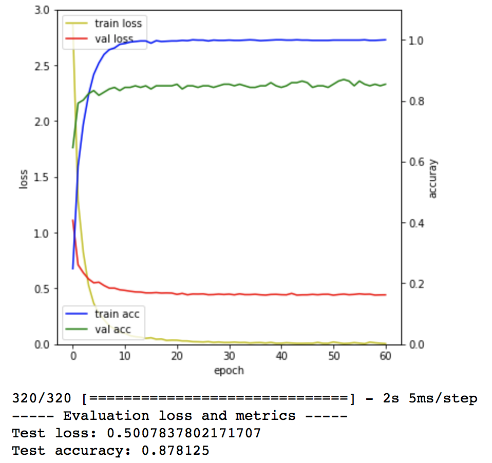
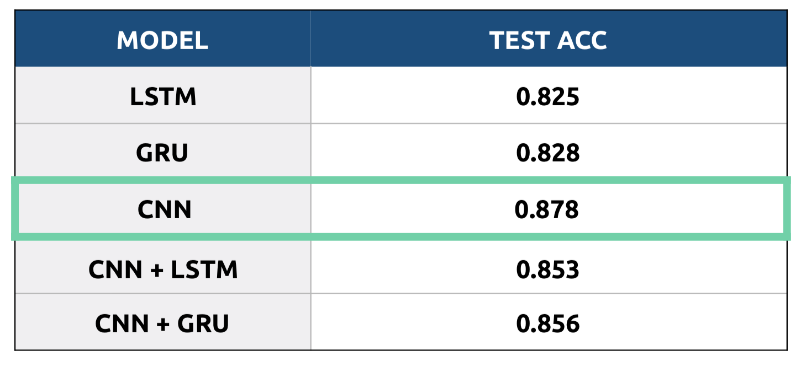

# Korean News Data Classificaiton

정치(0), 경제(1), 사회(2), 생활/문화(3), 세계(4), 기술/IT(5), 연예(6), 스포츠(7)로 분류되어 있는 1600개의 한국어 기사를 4:1(Train set : Test set) 비율로 나누어, Test Set의 클래스를 추론.

Korean news data classification by 8 classes

Politics(0), Economy(1), Social(2), Life/Culture(3), World(4), Tech/IT(5), Entertainment(6), Sports(7),

----
## 0. Source Code
- [Knews_classification.ipynb](https://github.com/Moog303/Korean_News_Classification/blob/master/knews_classification.ipynb)
- [Dataset](https://github.com/Moog303/Korean_News_Classification/tree/master/newsData) 0-159 : Train set, 160-199 : Test set

## 1. Pre-Processing
- Mecab 한국어 형태소 분석기 사용
- 동사와 명사만 활용

## 2. Word Embedding
- Fast Text 사용
- 32707 Vocab size Word-Vector Model 생성

## 3. Model
- LSTM, GRU, CNN, CNN+LSTM, CNN+GRU 5가지 모델의 성능 비교
- Validation Ratio : 0.15
- Best Model : CNN (implemented by yoon Kim's paper)

## 4. Reference
1. 조휘열, et al. "컨볼루션 신경망 기반 대용량 텍스트 데이터 분류 기술." 한국정보과학회 학술발표논문집 (2015): 792-794.
2. Kim, Yoon. "Convolutional neural networks for sentence classification." arXiv preprint arXiv: 1408.5882 (2014).

